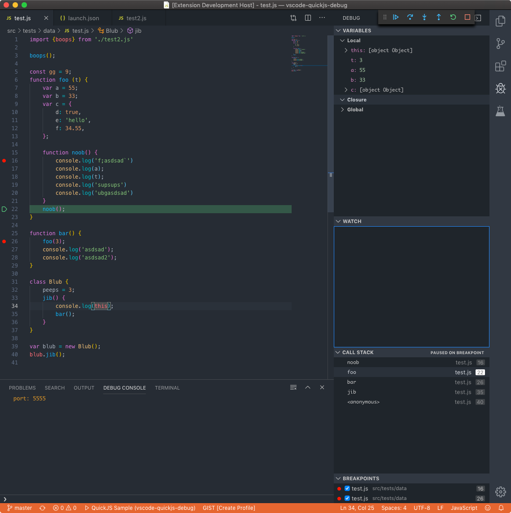

# QuickJS Debug for VS Code

This is a VS Code debug adapter for [QuickJS](https://bellard.org/quickjs/).

QuickJS Debugger supports *stepping*, *continue*, *breakpoints*, *evaluation*, and
*variable access*.

**The official QuickJS release does not have any debugger support.** The QuickJS Debugger requires a forked version of QuickJS, that has minimal changes necessary to support debugging.

## Using QuickJS Debug

* Install the [**QuickJS Debug** extension](https://marketplace.visualstudio.com/items?itemName=koush.quickjs-debug) in VS Code.
* Build the [QuickJS fork](https://github.com/koush/quickjs) from koush.
* Specify the qjs runtime path in [.vscode/launch.json](https://github.com/koush/vscode-quickjs-debug/blob/master/.vscode/launch.json).
* Switch to the debug viewlet and press the gear dropdown.
* Select the debug environment "Launch QuickJS".
* Press the green 'play' button to start debugging.

You can now step through the `test.js` file, set and hit breakpoints.



# Embedding

To listen for a connection in embedded quickjs (attach + connect with vscode debugger):
```c
// address is in format "0.0.0.0:6666" to listen on all addresses on port 6666
void js_debugger_wait_connection(JSContext *ctx, const char* address);
```

To initiate a connection in embedded quickjs (attach + listen with vscode debugger):
```c
// address is in format "192.168.1.66:6666" to connect to 192.168.1.66 on port 6666
void js_debugger_connect(JSContext *ctx, const char* address);
```

Alternatively, provide one of the following environment variables before starting the process embedded with QuickJS:

`QUICKJS_DEBUG_ADDRESS` or `QUICKJS_DEBUG_LISTEN_ADDRESS` with the same value as above.

Using these methods will block execution until the debugger has attached.


## Protocol

Protocol documentation is [here](protocol.md).
